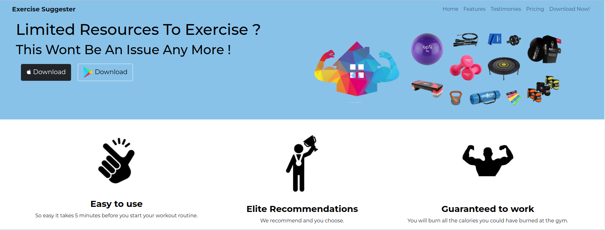
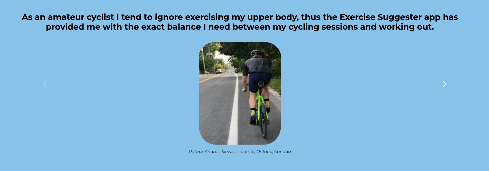
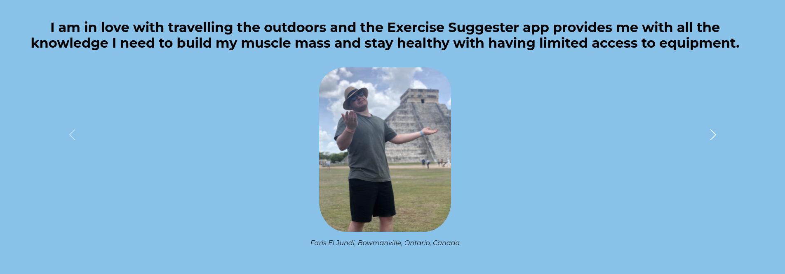

<h1>Welcome to my Exercise Suggester Web Application </h1>
<h2> About </h2>
<ul>
<li>
This is a single page landing page of a template for an Exercise Suggester Front End application
</li>
    <li>
HTML and CSS were used to build this application</li>
    <li>
CSS's Bootstrap is used in this web application </li>
    <li>
The web application can be found at: https://moehcci.github.io/exercise_suggester/ </li>
</ul>

<h2> Main Features From Bootstrap </h2>
<ul>
<li>
Navbar, Buttons, Carousels, Breakpoints, Containers, Grind System, Z-index, cards </li>
</ul>

<h2> Main Bootstrap Features - The Navbar & Hamburger </h2>
<ul>
<li>
A navbar and a hamburger functionality are included in the front end application as presented in the images below</li>
</ul>

<h2> Main Bootstrap Features - The Carousel </h2>
<ul>
<li>
A slider carousel is included as presented in the images below</li>
</ul>

